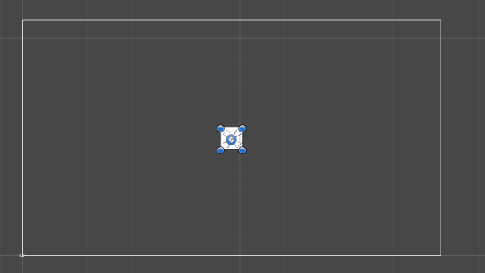

PlatinioTween
==============
Copyright (c) 2017 -2019 Unity Project by James Roman


What is this?
==============
This is a Unity3D Asset that let you create animations by code, and works very well animating UI.

Getting started
==============


Creating a tween
==============
this scale a transform from his current scale to (10.0f , 10.0f , 10.0f) in 2 seconds.
```c#
PlatinioTween.instance.ScaleTween(transform, Vector3.one * 10.0f , 2.0f);
```

Canceling a tween before it end
==============

Sometimes you will like to cancel a tween before it ends, if that is the case the recomended way is to set a GameObject as te owner, typically the GameObject creating the tween, and later use it to cancel the tween.

```c#
IEnumerator CO_TweenRoutine()
{
    PlatinioTween.instance.Move(gameObject , Vector3.zero , 5.0f).SetOwner(gameObject);
    yield return new WaitForSeconds(2.5f);
    PlatinioTween.instance.CancelTween(gameObject);
}
```
This will cancel all the tweens associate to the current GameObject.

But if you want you can cancel it using the id.

```c#
IEnumerator CO_TweenRoutine()
{
    int id = PlatinioTween.instance.Move( gameObject, Vector3.zero, 5.0f ).id;
    yield return new WaitForSeconds(2.5f);
    PlatinioTween.instance.CancelTween(id);
}
```

this will do the same as cancael using the GameObject.

Using Eases
==============
The best way to exaplain a Ease is just to see it on action :)

```c#
PlatinioTween.instance.Move(transform , Vector3.zero , 2.0f).SetEase(Ease.EaseOutElastic);
```
Will result in:


```c#
PlatinioTween.instance.Move(transform , Vector3.zero , 2.0f).SetEase( Ease.EaseOutBounce);
```
Will result in:


Animating UI Elements
==============

Ok it is really usefull create tweens via code, but the real stuff is to create UI Animations, if you has been try it before you know the hard stuff is to moving UI around because RectTransform positions are always relative to his anchor, this meas that say.

```c#
rectTransform.anchoredPosition = new Vector2(100.0f , 100.0f);
```

is diferent for every single element that has diferent anchors configuration, one way to made it "works" is to use the same anchor position for every single element that we want to animate, but if you has been try it you know that it creates more problems that it actually solve.

So i create a function to convert any anchoredPosition for any RectTransform to a global coordinate system, so you can move stuff around as precise as you want wiutout touching the anchors.

Use this as a giude to move stuff around inside a canvas.

     0.0 , 1.0 _______________________1.0 , 1.0
              |                      |
              |                      |                  
              |                      |
              |                      |
    0.0 , 0.0 |______________________| 1.0 , 0.0

Moving a Popup Example
==============
```c#
PlatinioTween.instance.MoveUI(rectTransform, new Vector2(0.5f , 0.5f), canvasRect, 0.5f).SetEase(Ease.EaseOutBounce);
```

So as we know from the previus guide (0.5 , 0.5) is the center of our canvas in the global coordinate system, so the previus code wil result in.


And then mixing stuff you can get a little creative.


Being more precise
==============

When comes to UI precision is all what matters, so in order to be more precise you can move around UI elements overriding his pivot, example:

```c#
PlatinioTween.instance.MoveUI(rectTransform , Vector2.one, canvas , 0.5f , PivotPreset.UpperRight);
```

So this code will produce this:



And you can even use your custom pivot.

```c#
PlatinioTween.instance.MoveUI(rectTransform , Vector2.one, canvas , 0.5f , new Vector2(0.5f , 0.8f));
```
More and More about Tweens
==============
